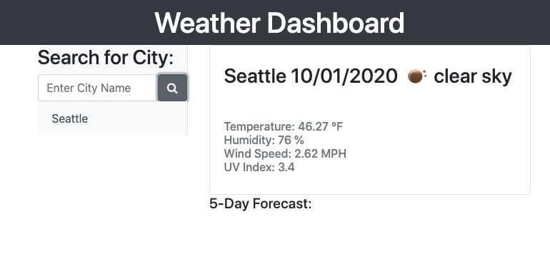

# WeatherDashboard

Installation:
 - Basic html page with using Bootstrap css
 - Access from: https://jericfey.github.io/WeatherDashboard

Summary: 
Create a weather dashboard using OpenWeather API https://openweathermap.org/appid to pull weather information for selected cities

 Additions: 
  - Used three Open Weather map https://openweathermap.org/  API to collect weather data, UV data, and 5 day forecast for each city
  - Used https://ip-api.com/ to get city Lat/Lon information to get the UV data from Open Weather API

